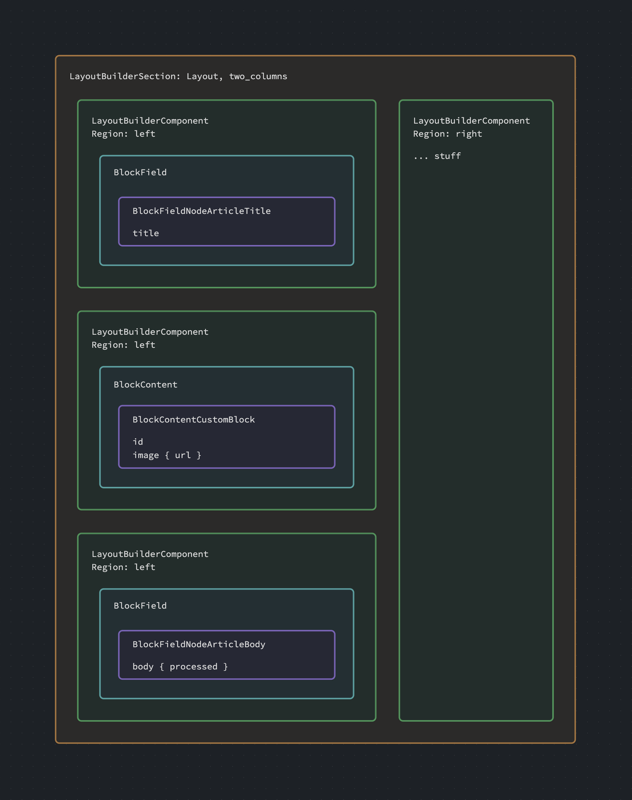

# Layout Builder (dev)

> :fire: Enable the **graphql_compose_layout_builder** module.\
> :baby: This module is in development preview, please provide your feedback to make it excellent.

## Currently on dev

This functionality is on the **dev** branch of graphql_compose, scheduled for beta-9.

```bash
composer require 'drupal/graphql_compose:2.0.x-dev@dev'
```

## Whats added

Each entity with Layout Builder enabled will receive:

- `LayoutBuilderInterface` interface.
- `sections` field.

## Enable layout builder

_The assumption here is you know how to use Layout Builder within Drupal._

- Enable Layout Builder on a Display Mode for your entity.
- Navigate to the `GraphQL Compose Settings` page at `/admin/config/graphql_compose`
- Select the entity bundle you want to enable.
- Click `Enable Layout Builder`

This option will ONLY appear next to a bundle that has a Layout Builder view mode enabled.

## The concept

- Node has sections
- Each section has a layout and components
- Each component is assigned to a region
- Each component has a block
- Each block is a type of block with it's own fields and settings



## Sections

Sections (`LayoutBuilderSection`) contain components and layout information.

You could re-construct the layout in your frontend by using the `layout` id to create a layout component (eg two columns), and then just place your `components` in the corresponding region/slot/prop area.

<!-- tabs:start -->

### **Query**

```graphql
{
  route(path: "/") {
    ... on RouteInternal {
      entity {
        ... on NodeArticle {
          sections {
            id
            layout {
              id
            }
            components {
              id
              region
            }
            settings
          }
        }
      }
    }
  }
}
```

### **Response**

```json
{
  "data": {
    "route": {
      "entity": {
        "sections": [
          {
            "id": "node.1.overrides.section.0",
            "layout": {
              "id": "layout_onecol"
            },
            "components": [
              {
                "id": "6291117c-f950-41d3-bacf-0fa0beb45b1b",
                "region": "content"
              },
              {
                "id": "1a6eb416-c399-4af1-b203-f7f2f763d06c",
                "region": "content"
              }
            ],
            "settings": []
          },
          {
            "id": "node.1.overrides.section.1",
            "layout": {
              "id": "layout_twocol_section"
            },
            "components": [
              {
                "id": "2e506135-96cc-4e69-8e0a-8d9098a7b432",
                "region": "first"
              },
              {
                "id": "9609433b-33b0-498a-b916-5b82fd31d628",
                "region": "second"
              }
            ],
            "settings": {
              "column_widths": "50-50"
            }
          }
        ]
      }
    }
  }
}
```

### **Schema**

```graphql
"""
This content has been arranged by a User using Layout Builder.
"""
interface LayoutBuilderInterface {
  sections: [LayoutBuilderSection!]
}

"""
A Layout Builder section defined by the CMS.
"""
type LayoutBuilderSection {
  """
  Machine readable identifier of the section.
  """
  id: ID!

  """
  A layout section component.
  """
  components: [LayoutBuilderComponent!]

  """
  The layout for this section.
  """
  layout: Layout!

  """
  The settings of the layout section.
  """
  settings: Attributes!

  """
  The delta position of the layout section.
  """
  weight: Int!
}
```

<!-- tabs:end -->

## Regions?

Region is on the component. The `region` is a reference to where you should put it on your frontend's layout. It's not _structural_. It's just a _hint_. As such we don't structure it in the schema.

It's up to you to decide where and how to render components in a section's layout.

```javascript
// Pseudo code example of how to get components for a region.
const getRegionComponents = (components, region) => {
  return components.filter((component) => component.region === region);
};
```

## Components

Components (`LayoutBuilderComponent`) are in a _region_, and contain blocks with configuration.

<!-- tabs:start -->

### **Query**

```graphql
{
  route(path: "/") {
    ... on RouteInternal {
      entity {
        ... on NodeArticle {
          sections {
            components {
              id
              region
              configuration
              block {
                __typename
              }
            }
          }
        }
      }
    }
  }
}
```

### **Schema**

```graphql
"""
A layout section component contains blocks of content.
"""
type LayoutBuilderComponent {
  """
  Machine readable name of the layout definition.
  """
  id: ID!

  """
  Blocks of content for the section component.
  """
  block: BlockUnion!

  """
  Any configuration for the component.
  """
  configuration: Attributes!

  """
  The region of the layout section component.
  """
  region: String!

  """
  The weight position of the layout section component.
  """
  weight: Int!
}
```

<!-- tabs:end -->

The configuration is _kind of_ unknown. It changes per component type. It's a dumb scala for now.

## Component Blocks

Blocks can be [standard blocks](/features/blocks.md) or a new type `BlockField`.

```graphql
components {
  block {
    __typename
    ... on BlockInterface {
      id
    }
    ... on BlockPlugin {
      render
    }
    ... on BlockContent {
      entity {
        ... on BlockContentBasicBlock {
          body {
            processed
          }
        }
      }
    }
    ... on BlockField {
      fieldName
      field {
        ### More below....
      }
    }
  }
}
```

## BlockField

The `BlockField` block acts as a proxy back to the entity field values. Each field enabled on the entity will have a BlockField block available.

- Each `interface field` is reduced into a generic type for each entity type. Eg `Node.title` &rarr; `BlockFieldNodeTitle`
- Each `content field` for an entity type is a specific type for that entity bundle. Eg `NodeArticle.body` &rarr; `BlockFieldNodeArticleBody`

<!-- tabs:start -->

### **Query**

```graphql
... on BlockField {
  fieldName
  field {
    ... on BlockFieldNodeTitle {
      title
    }
    ... on BlockFieldNodeArticleBody {
      body {
        processed
      }
    }
  }
}
```

### **Schema**

```graphql
"""
A block field is a modular field property that can be displayed in various regions of a website's layout.
"""
type BlockField implements BlockInterface {
  """
  The Universally Unique IDentifier (UUID).
  """
  id: ID!

  """
  The title of the block if provided.
  """
  title: String

  """
  The rendered output of the block.
  """
  render: Html

  """
  The entity field to be displayed within the block.
  """
  field: BlockFieldUnion!

  """
  The name of the field property to be displayed within the block.
  """
  fieldName: String!
}
```

<!-- tabs:end -->

> :warning: The BlockFields are user content. The editor could choose any field in your entities. Be prepared to deal with anything your user can do.

If fragmenting out your types out is too complex, consider using `render` instead.

## Full query example

```graphql
fragment BlockContentFragment on BlockContent {
  entity {
    __typename
    ... on BlockContentBasicBlock {
      body {
        processed
      }
    }
  }
}

fragment BlockFieldFragment on BlockField {
  fieldName
  field {
    __typename
    ... on BlockFieldNodeTitle {
      title
    }
    ... on BlockFieldNodeArticleBody {
      body {
        processed
      }
    }
    ... on BlockFieldNodeArticleTags {
      tags {
        ... on TermInterface {
          id
          name
        }
      }
    }
  }
}

fragment BlockPluginFragment on BlockPlugin {
  render
}

fragment BlockFragment on BlockInterface {
  id
  __typename
  ...BlockPluginFragment
  ...BlockContentFragment
  ...BlockFieldFragment
}

{
  route(path: "/") {
    ... on RouteInternal {
      entity {
        ... on NodeArticle {
          sections {
            id
            settings
            layout {
              id
            }
            components {
              id
              region
              block {
                ...BlockFragment
              }
            }
          }
        }
      }
    }
  }
}
```
