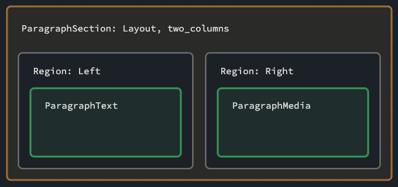

# Layout Paragraphs

> :fire: Enable the **graphql_compose_layout_paragraphs** module.

This feature will expose extra layout information on your `Paragraph` type entities.

## Install Layout Paragraphs module

```bash
composer require 'drupal/layout_paragraphs:^2.0'
```

## Whats added

Each enabled `Paragraph` type will receive:

- `LayoutParagraphsInterface` interface.
- `composition` field.

## Example build

In the example:

- ParagraphSection has layouts assigned in Layout Paragraphs.
- ParagraphText on the left
- ParagraphMedia on the right



When your Paragraph has a layout assigned to it, eg "Two Column", the `layout` field will return the layout information.

If you Paragraph is nested within a region of the layout, it's `position` will be returned.

<!-- tabs:start -->

### **Query**

```graphql
{
  nodePages(first: 1) {
    nodes {
      ... on NodePage {
        content {
          ... on ParagraphInterface {
            __typename
            id
          }
          ... on LayoutParagraphsInterface {
            composition {
              layout {
                id
              }
              position {
                parentId
                region
              }
            }
          }
        }
      }
    }
  }
}
```

### **Response**

```json
{
  "data": {
    "nodePages": {
      "nodes": [
        {
          "content": [
            {
              "__typename": "ParagraphSection",
              "id": "2b3af800-9e37-4dc4-9db8-e8e3caf665ee",
              "composition": {
                "layout": {
                  "id": "layout_twocol"
                },
                "position": null
              }
            },
            {
              "__typename": "ParagraphText",
              "id": "45599f85-f21c-47df-8601-4ca2578c6b5e",
              "composition": {
                "layout": null,
                "position": {
                  "parentId": "2b3af800-9e37-4dc4-9db8-e8e3caf665ee",
                  "region": "left"
                }
              }
            },
            {
              "__typename": "ParagraphMedia",
              "id": "0dedc0d0-3e9b-45e5-9bb0-2200dfafed6c",
              "composition": {
                "layout": null,
                "position": {
                  "parentId": "2b3af800-9e37-4dc4-9db8-e8e3caf665ee",
                  "region": "right"
                }
              }
            }
          ]
        }
      ]
    }
  }
}
```

<!-- tabs:end -->

So in the above you can see that:

- You have a `ParagraphSection` with an id of `2b3af800-9e37-4dc4-9db8-e8e3caf665ee`

  - It has a layout of `layout_twocol`
  - It has no position, as it's not nested within another Paragraph.

- You have a `ParagraphText`

  - It has no layout
  - It's parent is `2b3af800-9e37-4dc4-9db8-e8e3caf665ee` and it's region is `left`

- You have a `ParagraphMedia`
  - It has no layout
  - It's parent is `2b3af800-9e37-4dc4-9db8-e8e3caf665ee` and it's region is `right`

So now you just need some layout logic to tie all that together. An example might be:

```js
data.nodePages.nodes.forEach((page) => {
  const sections = page.content.filter(
    (item) => item.__typename === 'ParagraphSection'
  );
  sections.forEach((section) => {
    const template = section.composition.layout.id;
    const children = page.content.filter(
      (item) => item.composition.position.parentId === section.id
    );
    // Do something with template and children
  });
});
```
